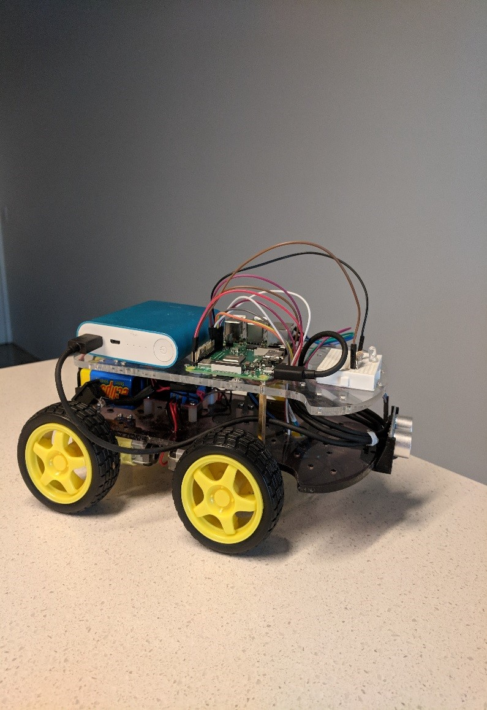
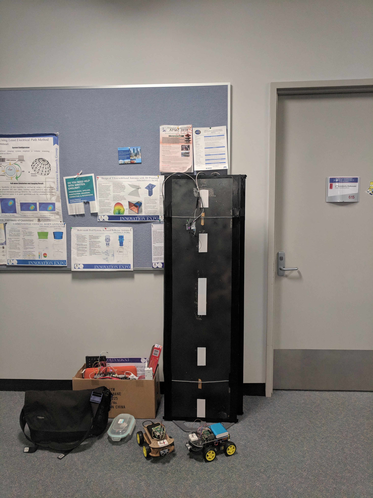

# Bad Actors in Vehicular Environment
A look into FMVSS NO. 150 proposed vehicular communication for road safety-application and BSM content verification.

#### Usage
This repo serves as a pointer and reference point for the 2 repos within: RSUServer and CarController.  
Here contains the research publication, guide and developmental objectives for RSUServer and CarControl.

##### RC Car broadcasting J2735 messages using 802.11ac

##### RSU Setup and Car

